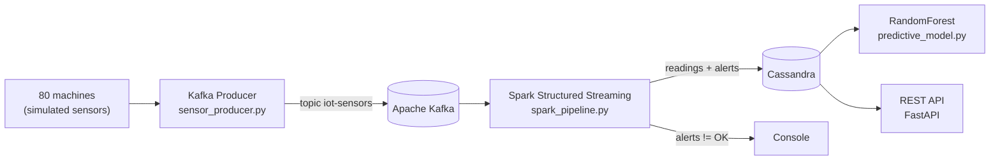

# SmartManuTech — Industrial predictive maintenance with Kafka and Spark

IoT monitoring system for a manufacturing plant: it collects telemetry from 80 machines
in real time, detects anomalies on the fly and trains a model that estimates
the probability of failure in the next 24 hours.

Project from the **Specialization Course in Artificial Intelligence and Big Data**
(Big Data Systems module).

## Architecture



## What each piece does

| Component | File | What it does |
|---|---|---|
| **Producer** | `producer/sensor_producer.py` | Simulates 80 machines and publishes temperature, vibration, production speed and power consumption to the `iot-sensors` topic. Injects anomalies into 2% of the readings so the pipeline has something to detect. |
| **Pipeline** | `pipeline/spark_pipeline.py` | Reads the Kafka stream, classifies each reading as `OK` / `WARNING` / `CRITICAL` / `ERROR` by thresholds, aggregates over 1-minute sliding windows (30 s slide) with a 10 s watermark, and writes to Cassandra. |
| **Model** | `m1/predictive_model.py` | Spark ML pipeline (VectorAssembler → StandardScaler → RandomForest, 100 trees) over the historical data, evaluated with AUC-ROC and with a feature importance ranking. |
| **API** | `api/api.py` | FastAPI: latest reading for a machine, active alerts, at-risk machines report and history. |

## Technical decisions

- **Sliding windows with a watermark.** A single high temperature reading means nothing;
  what matters is the average over the last minute. The 10 s watermark lets data arrive a
  little late without recomputing the whole world.
- **LZ4 compression and `linger_ms` in the producer.** With 80 machines emitting every
  half second, batching messages before sending them cuts traffic a lot.
- **Partition key by `machine_id`.** That way all the readings from one machine land in
  the same partition and arrive in order.
- **`StandardScaler` before the RandomForest.** The forest doesn't need it, but it keeps
  the importance ranking comparable across variables with very different scales.

## Project status

This is an **academic project**, not a production system. Worth knowing what is what:

- ✅ **Producer and pipeline**: working code against a real Kafka and a real Spark.
- ⚠️ **API**: the routes and the Pydantic models are defined, but they **return simulated
  data**. The Cassandra connection is left half-done (`session = None`).
- ⚠️ **Model**: it expects the historical data at `s3://smartmanutech-data/historical/`,
  which is part of the assignment and is not included here.

## Stack

Python · Apache Kafka · Apache Spark (Structured Streaming + MLlib) · Cassandra · FastAPI

## Running it

```bash
pip install kafka-python pyspark fastapi uvicorn

# 1) Producer (needs a broker at kafka-broker:9092)
python producer/sensor_producer.py

# 2) Streaming pipeline
spark-submit \
  --packages org.apache.spark:spark-sql-kafka-0-10_2.12:3.5.0,com.datastax.spark:spark-cassandra-connector_2.12:3.5.0 \
  pipeline/spark_pipeline.py

# 3) API
uvicorn api.api:app --host 0.0.0.0 --port 8000
```

Interactive API documentation at `http://localhost:8000/docs`.
