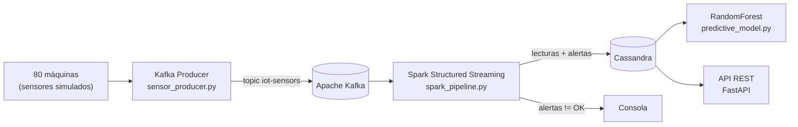

# SmartManuTech — Mantenimiento predictivo industrial con Kafka y Spark

Sistema de monitorización IoT para una planta de fabricación: recoge la telemetría
de 80 máquinas en tiempo real, detecta anomalías según pasa el dato y entrena un
modelo que estima la probabilidad de fallo en las próximas 24 horas.

Proyecto del **Curso de Especialización en Inteligencia Artificial y Big Data**
(módulo de Sistemas de Big Data).

## Arquitectura



## Qué hace cada pieza

| Componente | Fichero | Qué hace |
|---|---|---|
| **Productor** | `producer/sensor_producer.py` | Simula 80 máquinas y publica temperatura, vibración, velocidad de producción y consumo en el topic `iot-sensors`. Inyecta anomalías en un 2 % de las lecturas para que el pipeline tenga algo que detectar. |
| **Pipeline** | `pipeline/spark_pipeline.py` | Lee el stream de Kafka, clasifica cada lectura en `OK` / `WARNING` / `CRITICAL` / `ERROR` por umbrales, agrega en ventanas deslizantes de 1 minuto (salto de 30 s) con watermark de 10 s, y escribe en Cassandra. |
| **Modelo** | `m1/predictive_model.py` | Pipeline de Spark ML (VectorAssembler → StandardScaler → RandomForest, 100 árboles) sobre el histórico, evaluado con AUC-ROC y con ranking de importancia de variables. |
| **API** | `api/api.py` | FastAPI: última lectura de una máquina, alertas activas, informe de máquinas en riesgo e histórico. |

## Decisiones técnicas

- **Ventanas deslizantes con watermark.** Una lectura suelta de temperatura alta no
  significa nada; lo que importa es la media del último minuto. El watermark de 10 s
  permite que lleguen datos con algo de retraso sin recalcular el mundo entero.
- **Compresión LZ4 y `linger_ms` en el productor.** Con 80 máquinas emitiendo cada
  medio segundo, agrupar mensajes antes de enviarlos baja mucho el tráfico.
- **Clave de partición por `machine_id`.** Así todas las lecturas de una misma máquina
  caen en la misma partición y llegan en orden.
- **`StandardScaler` antes del RandomForest.** No le hace falta al bosque, pero deja el
  ranking de importancias comparable entre variables con escalas muy distintas.

## Estado del proyecto

Es un **proyecto académico**, no un sistema en producción. Conviene saber qué es qué:

- ✅ **Productor y pipeline**: código funcional contra un Kafka y un Spark reales.
- ⚠️ **API**: las rutas y los modelos Pydantic están definidos, pero **devuelven datos
  simulados**. La conexión a Cassandra está dejada a medias (`session = None`).
- ⚠️ **Modelo**: espera el histórico en `s3://smartmanutech-data/historical/`, que forma
  parte del enunciado y no se incluye aquí.

## Stack

Python · Apache Kafka · Apache Spark (Structured Streaming + MLlib) · Cassandra · FastAPI

## Ejecución

```bash
pip install kafka-python pyspark fastapi uvicorn

# 1) Productor (necesita un broker en kafka-broker:9092)
python producer/sensor_producer.py

# 2) Pipeline de streaming
spark-submit \
  --packages org.apache.spark:spark-sql-kafka-0-10_2.12:3.5.0,com.datastax.spark:spark-cassandra-connector_2.12:3.5.0 \
  pipeline/spark_pipeline.py

# 3) API
uvicorn api.api:app --host 0.0.0.0 --port 8000
```

Documentación interactiva de la API en `http://localhost:8000/docs`.
